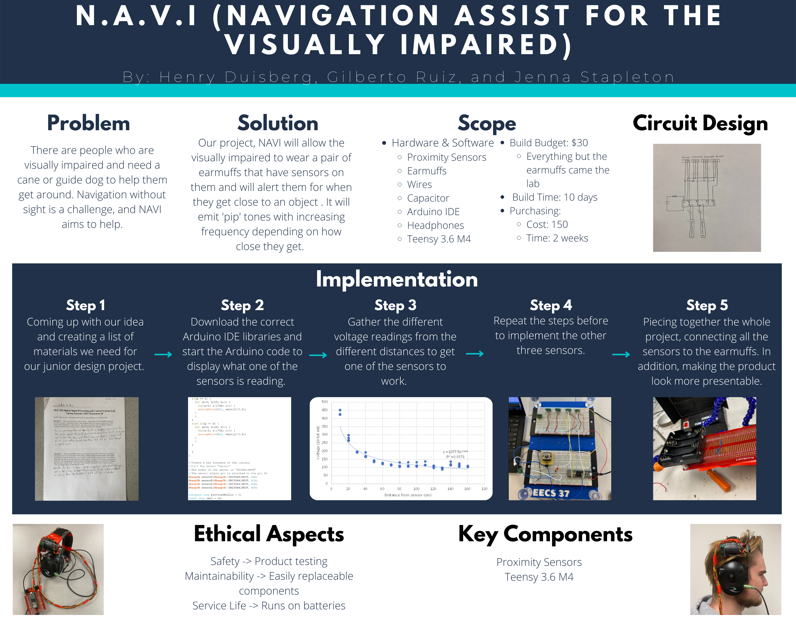
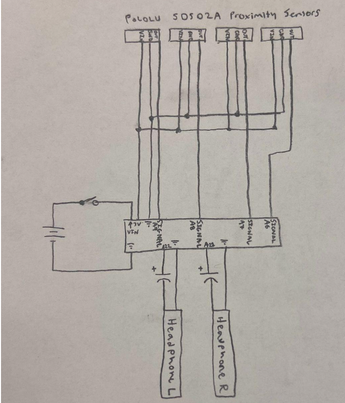

# N.A.V.I. - Navigational Assist for the Visually Impaired

N.A.V.I. (Navigational Assist for the Visually Impaired) is a wearable device designed to assist visually impaired individuals in navigating their surroundings. This project was developed as part of the **Junior Design Course (ELE 392)** at Syracuse University during Spring 2022. By using **infrared proximity sensors** and providing **audio cues**, N.A.V.I. allows users to detect obstacles in all directions and provides real-time feedback for safe navigation.

---

## Project Description

The N.A.V.I. device is a pair of modified earmuffs integrated with infrared proximity sensors and audio speakers. The sensors detect obstacles in the user’s vicinity and emit audio tones of varying frequencies depending on the proximity of the object. The project combined hardware, software, and ergonomic considerations to create a compact, cost-effective solution for visually impaired individuals.

### Key Features
- **Obstacle Detection**: Infrared sensors detect objects in all directions.
- **Real-Time Audio Feedback**: Custom sound cues alert users based on obstacle distance.
- **Compact Design**: Integrated the system into earmuffs for portability.
- **Cost-Effective Solution**: Designed within a $30 hardware budget.
- **Teensy Microcontroller Integration**: Leveraged the Teensy 3.6 M4 and the SharpIR library for sensor data processing.

---

## System Overview

### Problem Statement
Navigation without sight poses a significant challenge for visually impaired individuals. Many rely on canes or guide dogs, which can be cumbersome or expensive. N.A.V.I. provides an affordable, hands-free solution.

### Solution
N.A.V.I. incorporates proximity sensors into earmuffs, which emit specific audio tones to notify the user of obstacles. The device alerts users based on object proximity and direction, helping them navigate safely.

---

### System Architecture

#### Components
1. **Hardware**:
   - Infrared Proximity Sensors
   - Teensy 3.6 M4 Microcontroller
   - Soundproof Hunting Earmuffs
   - Custom-Built Circuit Board
2. **Software**:
   - SharpIR Library for sensor integration
   - Arduino IDE for programming

#### Circuit Design
The circuit integrates multiple infrared sensors and audio components. It processes distance data using the Teensy microcontroller and generates audio tones accordingly.

---

## Getting Started

### Prerequisites
- **Hardware Setup**: Assemble the components according to the circuit design.
- **Software Requirements**:
  - Arduino IDE
  - SharpIR Library

### Steps to Use
1. **Setup the Hardware**:
   - Power the Teensy microcontroller and connect the infrared sensors.
   - Ensure the audio output is properly integrated with the earmuffs.
2. **Upload Code**:
   - Upload the Arduino script to the Teensy microcontroller using the Arduino IDE.
3. **Testing**:
   - Test the device by moving it near obstacles and ensuring the correct audio cues are emitted.

---

## Reflections and Future Enhancements

### Achievements
- Developed a functional wearable navigation system for the visually impaired.
- Successfully integrated hardware and software for obstacle detection and real-time feedback.
- Delivered the project under budget and within a two-week timeline.

### Future Enhancements
- **Enhanced Detection**: Use higher-resolution sensors for improved obstacle detection.
- **Battery Optimization**: Improve power efficiency for extended use.

---

## Documentation

- **Final Report**: [Read the full report](media/NAVI_FinalReport.pdf)

---

## Acknowledgments

This project was developed in collaboration with:
- **Henry Duisberg**
- **Jenna Stapleton**

Supervised by Jennifer W. Graham, Ph.D., Syracuse University.
